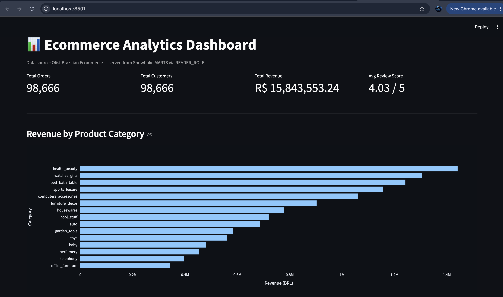

# ecommerce_pipeline

End-to-end data platform built on real e-commerce data, covering the full lifecycle from infrastructure provisioning to analytics consumption.

**Data source:** [Olist Brazilian E-Commerce dataset](https://www.kaggle.com/datasets/olistbr/brazilian-ecommerce) (~1.5M rows across 9 tables — orders, customers, products, sellers, payments, reviews, geolocation).

---

## Architecture

Python (extract + validate)
│
▼
Snowflake Internal Stage (PUT)
│
▼
RAW tables (COPY INTO)
│
▼
dbt staging (9 models — cleaning, type casting)
│
▼
dbt intermediate (2 models — business logic, enrichment)
│
▼
dbt marts (3 dimensions + 1 incremental fact — star schema)
│
▼
Streamlit dashboard (READER_ROLE, read-only)
Orchestrated end-to-end by Dagster (ingestion + all dbt models
as a single connected asset graph)
All infrastructure (database, warehouse, schemas, stage, roles,
grants) provisioned via Terraform.

---

## Tech stack

| Layer                  | Tool                                                                 |
| ---------------------- | -------------------------------------------------------------------- |
| Infrastructure as Code | Terraform (`snowflakedb/snowflake` provider)                         |
| Data Warehouse         | Snowflake                                                            |
| Ingestion              | Python (`snowflake-connector-python`, `click`, tested with `pytest`) |
| Transformation         | dbt (`dbt-snowflake`)                                                |
| Orchestration          | Dagster (`dagster-dbt`)                                              |
| Consumption            | Streamlit + Plotly                                                   |

---

## Architectural decisions

### No cloud storage (Azure/AWS) in the ingestion path

The original design used Azure Blob Storage as a landing zone before loading into Snowflake. Due to a blocked Azure Free Tier signup (card verification issue), the pipeline uses **Snowflake internal stages** instead (`PUT` + `COPY INTO`), removing the external cloud storage dependency entirely.

This is documented here as a deliberate trade-off: the architecture is easily extensible to an external stage (Blob/S3) if needed — only the `terraform/modules/snowflake_warehouse` module and the `load_to_snowflake.py` upload target would need to change.

### RBAC design

Three roles, each scoped to the minimum privilege it needs:

| Role               | Used by          | Access                                                                |
| ------------------ | ---------------- | --------------------------------------------------------------------- |
| `LOADER_ROLE`      | Python ingestion | Write access to `RAW` only                                            |
| `TRANSFORMER_ROLE` | dbt              | Read `RAW`, write `STAGING` / `INTERMEDIATE` / `MARTS`                |
| `READER_ROLE`      | Streamlit        | Read-only on `MARTS` (and `INTERMEDIATE` views used by the dashboard) |

For this trial/learning project, all three roles are granted to the developer's own Snowflake user, so the same person can switch roles manually (`USE ROLE ...`) during local development. In a production setup, each role would instead be granted to a dedicated service user (e.g. `SVC_LOADER`, `SVC_DBT`, `SVC_STREAMLIT`), so that each automated process authenticates with its own identity.

Grants combine `all` (covers objects that already exist) and `future` (covers objects created later, e.g. by dbt) — `all` alone does not retroactively apply to objects created after the grant was first applied, which was learned the hard way (see Troubleshooting below).

### RAW tables use VARCHAR for every column

Type casting and cleaning happen in dbt staging models, not during ingestion. This keeps the ingestion layer simple and resilient to source data quirks (malformed numbers, inconsistent date formats).

### Incremental fact table on a historical dataset

`fct_orders` is configured as `incremental` (merge strategy), even though the Olist dataset is historical and closed (no new data actually arrives). This is intentional — it demonstrates the pattern used in production pipelines with continuously arriving data, using `order_purchase_at` as the watermark.

### review_id is not globally unique

The Olist source data links the same `review_id` to multiple `order_id`s in some cases — a documented quirk of this dataset. Rather than masking this with a naive `unique` test (which would fail), the true grain (`review_id + order_id`) is documented and tested explicitly with `dbt_utils.unique_combination_of_columns`.

---

## Development workflow

- Feature branches: `users/<your-username>/feature-<short-description>`
- Commit messages: `[#EM-XXX] <message>`
  - Example: `[#EM-001] update README`
- Flow: `feature → dev → main`

---

## Project structure

ecommerce_pipeline/
├── terraform/
│ ├── modules/snowflake_warehouse/ # database, warehouse, schemas, stage, roles, grants
│ └── environments/dev/
├── ingestion/
│ ├── src/ # config, extract, load_to_snowflake, cli
│ └── tests/ # pytest unit tests
├── dbt_project/
│ └── models/
│ ├── staging/ # 1:1 with RAW tables, cleaning + casting
│ ├── intermediate/ # business logic, enrichment
│ └── marts/ # star schema: dimensions + incremental fact
├── orchestration/
│ └── dagster_project/
│ └── assets/ # ingestion_assets.py, dbt_assets.py
└── streamlit_app/
└── app.py # dashboard, reads from MARTS via READER_ROLE

---

## Setup — from zero

### 1. Requirements

- macOS, Homebrew
- Python 3.13 (Dagster's dbt integration does not yet support 3.14 — see Troubleshooting)
- A Snowflake account (trial works fine)
- Terraform

```bash
brew install python@3.13
brew tap hashicorp/tap
brew install hashicorp/tap/terraform
```

### 2. Infrastructure

```bash
cd terraform/environments/dev
cp terraform.tfvars.example terraform.tfvars
# edit terraform.tfvars with your Snowflake credentials
terraform init
terraform apply
```

### 3. Ingestion

Download the [Olist dataset](https://www.kaggle.com/datasets/olistbr/brazilian-ecommerce) and place the 9 CSVs in `ingestion/data/raw/`.

```bash
cd ingestion
python3 -m venv .venv
source .venv/bin/activate
pip install -r requirements.txt
cp .env.example .env
# edit .env with your Snowflake credentials (SNOWFLAKE_ROLE=LOADER_ROLE)
python3 -m src.cli load
pytest -v
```

### 4. dbt

```bash
cd ../dbt_project
python3 -m venv .venv
source .venv/bin/activate
pip install dbt-snowflake

# profiles.yml lives outside the repo, in ~/.dbt/ — see below
dbt deps
dbt build
dbt docs generate && dbt docs serve
```

Create `~/.dbt/profiles.yml` (not committed — contains credentials):

```yaml
ecommerce_pipeline:
  target: dev
  outputs:
    dev:
      type: snowflake
      account: "{{ env_var('SNOWFLAKE_ORGANIZATION_NAME') }}-{{ env_var('SNOWFLAKE_ACCOUNT_NAME') }}"
      user: "{{ env_var('SNOWFLAKE_USER') }}"
      password: "{{ env_var('SNOWFLAKE_PASSWORD') }}"
      role: TRANSFORMER_ROLE
      database: ECOMMERCE_DB
      warehouse: ECOMMERCE_WH
      schema: STAGING
      threads: 4
```

```bash
cd ..
source load_env.sh   # exports ingestion/.env into the shell for dbt's env_var()
```

### 5. Orchestration (Dagster)

```bash
cd orchestration/dagster_project
python3.13 -m venv .venv
source .venv/bin/activate
pip install -r requirements.txt

cd ..
dagster dev -m dagster_project.definitions
```

Open `localhost:3000`, select all assets, and click **Materialize** to run the full pipeline (ingestion → dbt build) end to end.

### 6. Dashboard

```bash
cd ../../streamlit_app
python3 -m venv .venv
source .venv/bin/activate
pip install -r requirements.txt
cp .env.example .env
# edit .env with your Snowflake credentials (SNOWFLAKE_ROLE=READER_ROLE)
streamlit run app.py
```

---

## Troubleshooting notes

A few real issues hit while building this, kept here since they're common gotchas with this exact stack:

- **`dagster-dbt` does not yet support Python 3.14** — the orchestration module needs its own venv on Python 3.13.
- **CSV BOM (Byte Order Mark)** on `product_category_name_translation.csv` broke column name resolution in Snowflake (`invalid identifier`). Fixed by reading files with `encoding="utf-8-sig"` instead of `"utf-8"`.
- **Snowflake `snowflake_grant_account_role` is case-sensitive on `user_name`** — passing a lowercase username when the actual Snowflake user is uppercase silently fails with `object does not exist or not authorized`.
- **Terraform `all` grants don't retroactively cover objects created later** — a table created by dbt _after_ the grant was first applied won't have the grant, even though `terraform plan` shows no diff. Fixed by combining `all` + `future` grants, and using `terraform apply -replace=...` to force resync when needed.
- **`load_dotenv()` doesn't override existing shell environment variables by default** — if a different project's `.env` was `source`d earlier in the same terminal session, stale variables silently win. Fixed with `load_dotenv(override=True)`.

## Dashboard


